# Build Serverless Applications with Apache OpenWhisk!

- Step 0: Sign up for IBM Cloud
- Step 1: Create, build, and run a cloud-native Node.js serverless app in less than 15 minutes
- Step 2: Create a cloud-native Python serverless application that uses Visual Recognition
- Step 3: Create, build, and run three serverless functions as a sequence
- Step 4: (Stretch goal) Configure the IBM Cloud CLI
- Step 5: (Stretch goal) Create a Weather Bot

# Step 0: Sign up for IBM Cloud
- [IBM Cloud Sign Up](http://ibm.biz/hacker-dojo-serverless) - http://ibm.biz/hacker-dojo-serverless

**Q: I'm having issues signing up for IBM Cloud during the workshop.**

**A:** This may be due to the large number of attendees signing up on the same network. Try visiting your registration link on your phone (not connected to Wi-fi) and then logging in on your laptop.

**Q: What if I already have an IBM Cloud account?**

**A:** Visit http://ibm.biz/hacker-dojo-serverless and log in to your account.

# Step 1: Create, build, and run a cloud-native Node.js serverless app in less than 15 minutes

This lab walks you through the steps required to create, build, and run a **Serverless application** using IBM Cloud Functions. Serverless computing refers to a model where the existence of servers is entirely abstracted away. Even though servers exist, developers are relieved from the need to care about their operation. They are relieved from the need to worry about low-level infrastructural and operational details such as scalability, high-availability, infrastructure-security, and other details. Serverless computing is essentially about reducing maintenance efforts to allow developers to quickly focus on developing code that adds value.

Serverless computing simplifies developing cloud-native applications, especially microservice-oriented solutions that decompose complex applications into small and independent modules that can be easily exchanged. Some promising solutions like Apache OpenWhisk have recently emerged that ease development approaches used in the serverless model. IBM Cloud Functions is a Function-as-a-Service (FaaS) platform on IBM Cloud, built using the Apache OpenWhisk open source project, that allows you to execute code in response to an event.

It provides a serverless deployment and operations model. With a granular pricing model that works at any scale, you get exactly the resources you need – not more, not less – and you are charged for code that is really running.

**IBM Cloud Functions provides:**
* Support for multiple languages, including JavaScript, Python, Swift, and Java
* Support for running custom logic through Docker containers

**IBM Cloud Functions & Apache OpenWhisk:**
* The ability to focus more on value-adding business logic, and less on low-level infrastructural and operational details.
* The ability to easily chain together microservices to form workflows via composition.

## PREREQUISITES FOR THIS LAB

* You will need an IBM Cloud Account. Either use your existing account, or create a new account by accessing the following link: http://ibm.biz/hacker-dojo-serverless

## CREATE AN ACTION IN THE CLOUD FUNCTIONS UI
There are two main options to get started with Cloud Functions. Both allow you to work with Cloud Function’s basic entities by creating, updating, and deleting actions, triggers, rules and sequences.

The CLI (command line interface) allows you to perform these basic operations from your shell. The IBM Cloud Functions UI (user interface), allows you to perform the same operations from your browser. As a stretch goal, step 4 of this lap involves installing the CLI. During this step of this lab we will use the UI to learn how to work with Cloud Functions.

1. Start by logging into the IBM Cloud: http://ibm.biz/hacker-dojo-serverless, and then selecting the hamburger menu in the header.

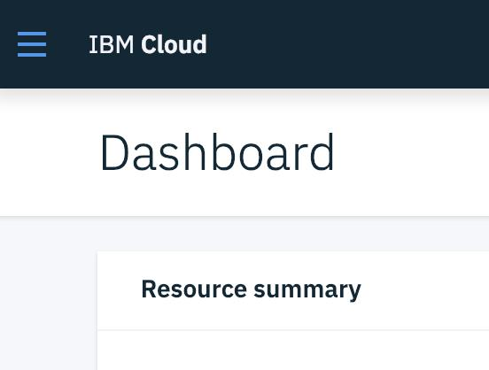

2. Then click on Functions to access the IBM Cloud Functions development experience on IBM Cloud.

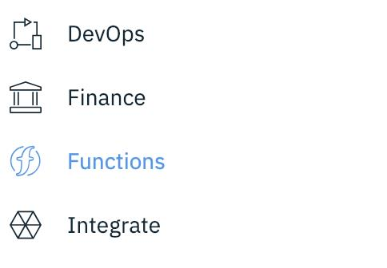

3. The Cloud Functions UI is comprised of the following sections in the left hand side menu bar. You will learn about these basic entities in later sections.

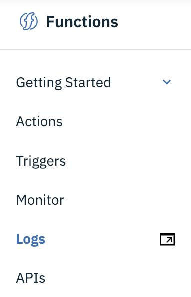

* Actions – The actions section lists all actions you have created prior. An action is a small piece of code that can be explicitly invoked or set to automatically run in response to an event.
* Triggers – A trigger is a declaration that you want to react to a certain type of event, whether from a user or by an event source. A trigger can be fired or activated. Triggers can be associated with actions, so that when the
trigger is fired the action is run.
* Monitor – This section shows you information about your actions and their activity, including an activity summary and timeline.
* Logs – The logs section takes you to the IBM Cloud Logging service, which provides you with the ability to collect, analyze, and build dashboards for
your logs.
* APIs – The APIs section allows you to set up an API Gateway and API
management for IBM Cloud Functions. This is beyond the scope of today’s
lab.

4. Start creating your first action by selecting the **Start Creating** button in the center of the UI, which opens the Create page. Then select the **Create Action** button.

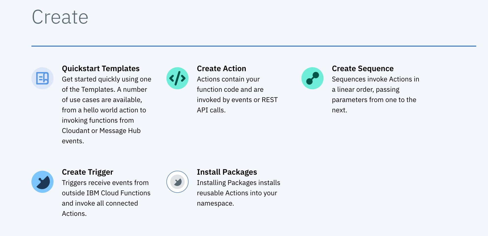

5. Specify an Action Name (e.g. hello), by entering it into the text field, and then select Node.js 10 as the runtime. Leave everything else as-is and click the **Create** button at the bottom of the screen.

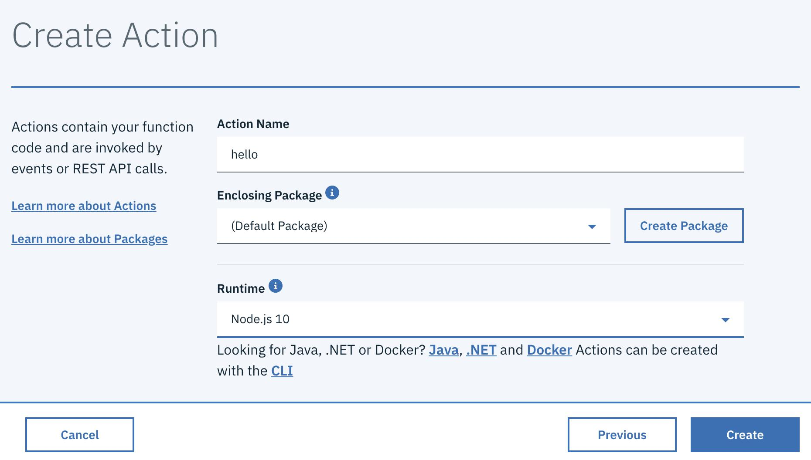

6. This opens a cloud-based code editor that you can use to create and extend your actions. There should already be some hello world code in the action.

7. Click **Invoke** to test this action directly from within your browser. You should see an Activations panel show up with the result.

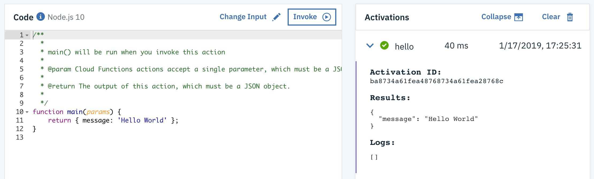

8. Actions may be invoked with a number of named parameters. Let’s try out an action that accepts parameters. Update the action code by copy-pasting the following into the code section:

```
function main(params) {
return { message: 'Hello, ' + params.name + ' from ' + params.place };
}
```

9. Click **Save**, then click **Invoke**. In the activations panel, you should see a result of Hello undefined from undefined. This is expected, because we didn’t provide the action with any parameters. Let’s do this.

10. Click on the **Change Input** button, and update the parameters with the following json:
```{"name":"ibmdevelopersf","place":"San Francisco"}```

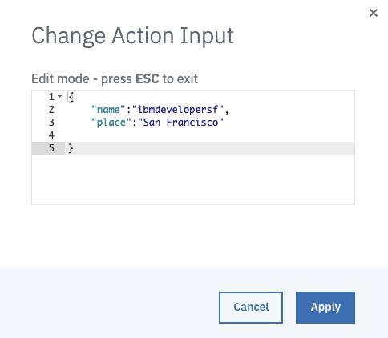

11. Click the **Apply** button, and then click **Invoke** again to invoke your action. You should see an activation result with the name and place you provided.

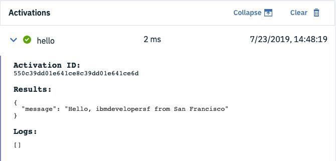

## CREATE A TRIGGER IN THE CLOUD FUNCTIONS UI

IBM Cloud Functions is a Functions-as-a-Service (FaaS) platform that executes code in response to events. Events can be emitted by services, such as other services that are a part of the IBM Cloud. These services have triggers that represent a named channel for a stream of events. Events can also be emitted in the form of API calls, fired by standard web or mobile applications, which can then trigger actions.

So far, we’ve only triggered our actions manually. Let’s try to trigger our actions periodically.

1. Update the existing action to contain the following code:

```
function main(params) {
var date = new Date();
var time = date.getHours() + ":" + date.getMinutes() + ":" + date.getSeconds();
return { message: "The time is " + time };
}
```

2. Click **Save**. This action returns the time. Try it out by clicking **Invoke**.

3. Next, click the **Connected Triggers** button on the left pane. This will allow you
to add a Trigger that causes the action to be run.

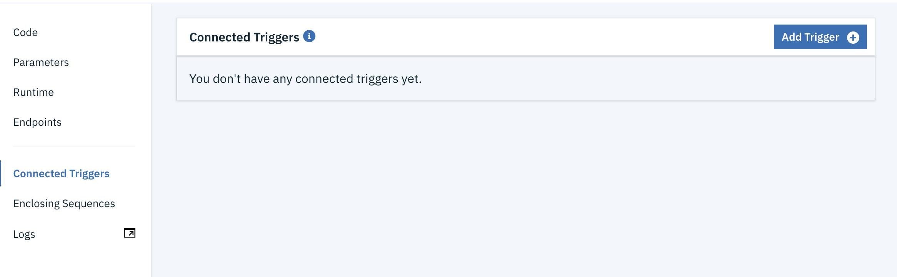

4. Click on **Add Trigger** on the right side of the panel, and select a **Periodic Trigger** as the type.

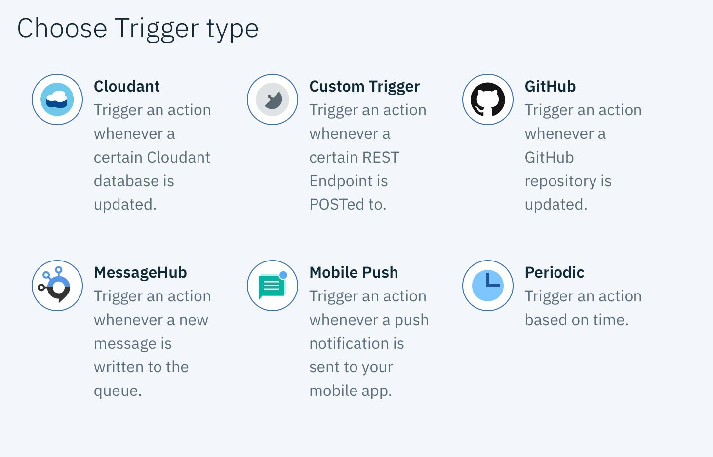

5. Give your trigger a name (e.g. “minute-alarm”)

6. scroll down to “UTC Minutes,” and select “Every Minute” from the pull down
menu:


7. Click **Create & Connect** to create the trigger and connect your action to it. Return the dashboard by clicking on **Actions** in the breadcrumbs.


8. Click **Monitor** to see the activity of your actions and triggers. The Activity Log should show your action being triggered, and the time it was triggered in the result. If you don’t see the result, click the check mark for more details.

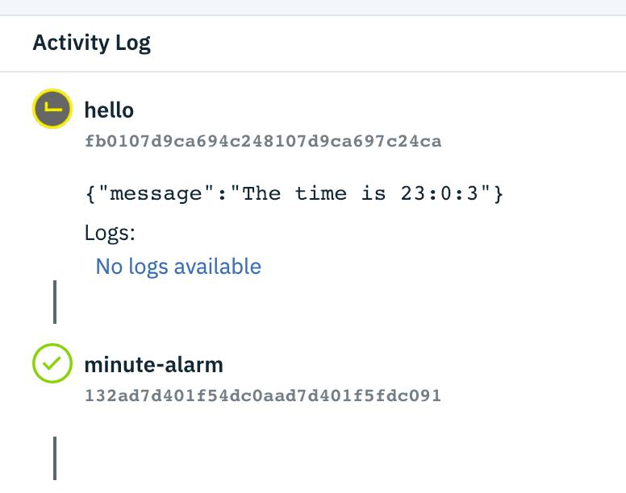

9. To delete the trigger, expand the **Triggers** section, select your **minute-alarm** trigger you just created, and click the trash bin from the pull-down menu.

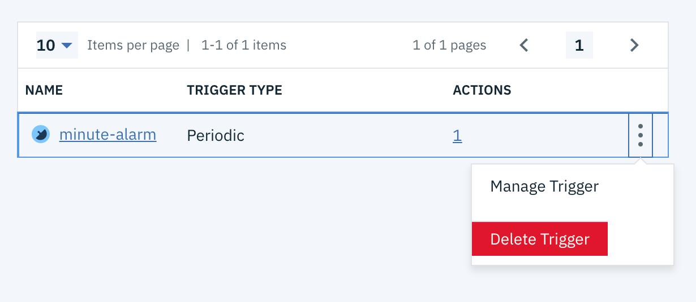

## CREATE A WEB ACTION

1. Select Actions from the left-hand panel.

2. Find your hello action, and mange it by clicking on its name.

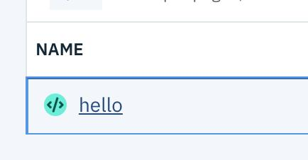

3. Change the code back to our hello action that takes name and place parameters:

```
function main(params) {
return { message: 'Hello, ' + params.name + ' from ' + params.place };
}
```

4. Click **Save**.

5. To add a web endpoint and create a web action, select Endpoints from the left
side menu, and select Enable as a Web Action.

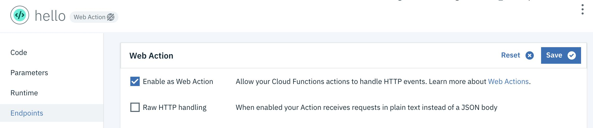

6. Click **Save** again. Copy the URL to the clipboard, using the clipboard icon.

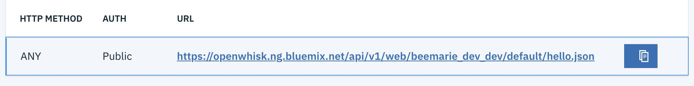

7. Once you have the URL copied, paste it as the URL into a browser window, and append the following parameters to the request to pass the name and place input parameters into the Action:
```?name=ibmdevelopersf&place=SF```

8. As a response, you should then get the output of your action:

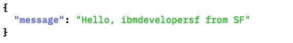

9. This URL can be accessed by any http request. Disable the web action before you leave by deselecting the checkbox next to **Enable as Web Action** and clicking **Save**.

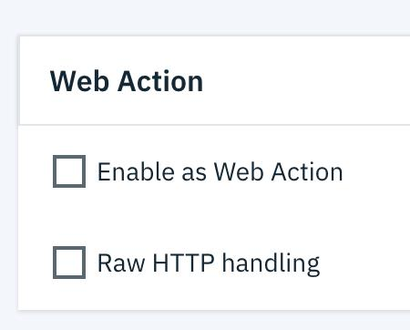

## CONCLUSION
Congratulations! You have completed the lab. You have successfully built and deployed a number of Serverless Cloud Functions, including web actions that can be invoked from the browser or from microservices, all inside a browser! Feel free to reach out should you have any questions.


# Step 2: Create, build, and run a cloud-native Python serverless application that uses the Visual Recognition service to determine image content

## INTRODUCTION

In this lab, you’ll create an IBM Cloud Functions action that takes an image URL as input, and returns some tags describing the content of the image. To get the tags, the action will interact with the Visual Recognition Service on IBM Cloud.

## PREREQUISITES FOR THIS LAB
            
* You will need an IBM Cloud Account. Either use your existing account, or create a new account by accessing the following link: http://ibm.biz/hacker-dojo-serverless

## CREATE A VISUAL RECOGNITION SERVICE
For this quicklab, you will need to provision a Visual Recognition service in the IBM Cloud.

1. Start by logging into the IBM Cloud: http://ibm.biz/hacker-dojo-serverless, and then select the **Create Resource** button in the top right. If you do not see Create Resource, you can select **Catalog**.

2. Select **AI** in the left menu, and then select **Visual Recognition**. You can create only one free **lite tier** resource with the free IBM Cloud account. If you already have a visual recognition service, either delete it and follow these steps or you can skip to step 4 to get the credentials.


3. Give your service a name, and then click **Create**.


4. Click **Service Credentials** to ensure a set of service credentials were generated for you (you may need to refresh this page).
a. If not, click **New Credential**, and then **Add**.

5. Click **view credentials** and take note of the **apikey**provided. You will need this later on in the lab, so you may want to copy it to a notes file.

## CREATE AN ACTION IN THE CLOUD FUNCTIONS UI

There are two main options to get started with Cloud Functions. Both allow you to work with Cloud Function’s basic entities by creating, updating, and deleting actions, triggers, rules and sequences.

The CLI (command line interface) allows you to perform these basic operations from your shell. The IBM Cloud Functions UI (user interface), allows you to perform the same operations from your browser. During this lab we will use the UI to learn how to work with Cloud Functions.

1. Select the hamburger menu in the IBM Cloud header.


2. Then click on **Functions** to access the IBM Cloud Functions development experience on IBM Cloud.


3. The Cloud Functions UI is comprised of the following sections in the left-hand side menu bar.


4. Start creating your first action by selecting the Start Creating button in the center of the UI, which opens the Create page. Then select the Create Action button.


5. Specify an **Action Name** (e.g. openwhisk-vr), by entering it into the text field, and then select **Python** as the runtime. Leave everything else as-is and click the **Create** button at the bottom of the screen.


6. This opens a cloud-based code editor that you can use to create and extend your actions. There should already be some hello world code in the action.

7. Click **Invoke** to test this action directly from within your browser. You should see an Activations panel show up with the result. The result should be “Hello world”


## USE THE BUILT IN VISUAL RECOGNITION SDK FROM YOUR PYTHON ACTION.

Each IBM Cloud Functions runtime comes with some packages already pre- installed to the environment. The Python runtime includes the Watson Developer Cloud SDKs (Software Development Kits) including the visual recognition SDK we’ll use today. 

We’ll import this visual recognition SDK to make calls to the service in a python-native way.

1. Replace the hello world Python code with the following code, found on the next page. You can copy paste this code from this github gist: https://ibm.biz/openwhisk-vr-1

```
from watson_developer_cloud import VisualRecognitionV3
def main(params):
    # init visual recognition library
    apiKey = params['apiKey']
    version = "2018-03-19"
    visual_recognition = VisualRecognitionV3(version=version, iam_apikey=apiKey)
    # get image url from params
    image_url = params['imageUrl']
    # parse visual recognition return data for our tags
    tags = ""
    classifiedImages = visual_recognition.classify(url=image_url).get_result()
    image = classifiedImages['images'][0]
    classes = image['classifiers'][0]['classes']
    for theClass in classes:
        currentTag = theClass['class']
        print(currentTag)
        tags = tags + currentTag + ", "
    result = {'classes': tags}
    return result
```

2. Click **Save**. Look over the code. You can see we’re importing the **VisualRecognitionV3** SDK as promised. Find where we’re instantiating the SDK (around line 7). You can see that we will need the apikey we saved before. This action expects the apiKey to be passed in as a parameter.’

```
# init visual recognition library
apiKey = params['apiKey']
version = "2018-03-19"
visual_recognition = VisualRecognitionV3(version=version, iam_apikey=apiKey)
```

3. Default parameters can be set for an action, rather than passing the parameters into the action every time. This is a useful option for data that stays the same on every invocation. Let’s set the apiKey as one of our default parameters. Click **Parameters** in the left side menu, and then click **Add Parameter +**.


4. For parameter name, **apiKey**, with a capital **K**. For parameter value, insert your apiKey value enclosed in quotation marks.


5. Click **Save**.

## USE THE BUILT IN VISUAL RECOGNITION SERVICE TO CLASSIFY AN IMAGE

1. Let’s inspect the code a little more. You can see that this action also takes as input an imageUrl. It then passes that imageUrl to the visualRecognition service, and does some simple parsing of the results – ultimately returning the “classes” representing the contents of the image.

```
classifiedImages = visual_recognition.classify(url=image_url).get_result() image = classifiedImages['images'][0]
classes = image['classifiers'][0]['classes']
for theClass in classes:
    currentTag = theClass['class']
    print(currentTag)
    tags = tags + currentTag + ", "
result = {'classes': tags}
```

2. Change the input for this function to be an image URL by clicking **Change Input**, and then pasting in the following json.

```{"imageUrl":"https://raw.githubusercontent.com/beemarie/ow- vr/master/images/puppy.jpg"}```

3. This is an image of a cute puppy. **Click Apply**.


4. Click **Invoke** to run the action. This action will pass the image to the Visual Recognition service to classify, then parse the returned information, and finally output just the classes or tags of the image.

5. You should see some results in the Activations window like **Labrador Retriever, dog, pup,** and **animal**.


## CONCLUSION

**Congratulations!** You have completed this lab. You have successfully created and used a Visual Recognition service. You have also built and deployed a Serverless Cloud Function, saw some Python and features, and used the Visual Recognition SDK built in with the language runtime – all from within a browser! Feel free to reach out should you have any questions.


# Step 3: Create, build, and run three serverless functions as a sequence


# Step 4: (Stretch goal) Configure the IBM Cloud CLI

1. Open the [IBM Cloud Docs](https://console.bluemix.net/docs/) page.
2. Open the *"[IBM Cloud Developer Tools (CLI)](https://console.bluemix.net/docs/cli/index.html#overview)"* link from the *"IBM Cloud"* section.
3. Click on the *"[Download and install IBM Cloud CLI](https://console.bluemix.net/docs/cli/reference/bluemix_cli/download_cli.html#download_install)"* link under *"HOW TO"* section in the left-hand menu.
4. Follow the steps listed under the *["Install from shell"](https://cloud.ibm.com/docs/cli/reference/bluemix_cli?topic=cloud-cli-install-ibmcloud-cli#shell_install)*  section to download and install the IBM Cloud CLI.

- MacOS: `curl -fsSL https://clis.cloud.ibm.com/install/osx | sh`
- Linux: `curl -fsSL https://clis.cloud.ibm.com/install/linux | sh`
- Windows (Powershell): `iex(New-Object Net.WebClient).DownloadString('https://clis.cloud.ibm.com/install/powershell')')`

### Log Into IBM Cloud CLI

1. Use this command to authenticate the IBM Cloud CLI with your account credentials.

   ```
   $ ibmcloud login
   ```

2. Choose an API endpoint from the list.
   ***IBM Cloud Functions is available in the following regions: `eu-de`, `eu-gb` and `us-south`. Lite account users must choose their default account region.***

   ```
   Select an API endpoint:
   1. eu-de - https://api.eu-de.cloud.ibm.com
   2. au-syd - https://api.au-syd.cloud.ibm.com
   3. us-east - https://api.us-east.cloud.ibm.com
   4. us-south - https://api.ng.cloud.ibm.com
   5. eu-gb - https://api.eu-gb.cloud.ibm.com
   6. Enter a different API endpoint
   Enter a number> 
   ```

3. Enter account credentials for your IBM Cloud account.

   ```
   Email> user@email.com

   Password>
   Authenticating...
   OK

   Select an account (or press enter to skip):
   1. John Smith's Account (xxx)
   Enter a number>

   API endpoint:     https://api.eu-gb.bluemix.net (API version: 2.92.0)
   Region:           eu-gb
   User:             user@email.com
   Account:          No account targeted, use 'bx target -c ACCOUNT_ID'
   Resource group:   No resource group targeted, use 'bx target -g RESOURCE_GROUP'
   Org:
   Space:

   ```

4. Run the following command to configure the organisation and space the CLI is targeting.

   ```
   $ ibmcloud target --cf
   Targeted org user@email.com
   Targeted space dev

   API endpoint:     https://api.eu-gb.bluemix.net (API version: 2.92.0)
   Region:           eu-gb
   User:             user@email.com
   Account:          No account targeted, use 'bx target -c ACCOUNT_ID'
   Resource group:   No resource group targeted, use 'bx target -g RESOURCE_GROUP'
   Org:              user@email.com
   Space:            dev
   ```

### Install IBM Cloud Functions CLI plugin

1. Use this command to install the Cloud Functions plugin for the IBM Cloud CLI.

   ```
   $ ibmcloud plugin install cloud-functions
   Looking up 'cloud-functions' from repository 'Bluemix'...
   Plug-in 'cloud-functions 1.0.7' found in repository 'Bluemix'
   Attempting to download the binary file...
    11.13 MiB / 11.13 MiB [=================================================================================] 100.00% 9s
   11665633 bytes downloaded
   Installing binary...
   OK
   Plug-in 'cloud-functions 1.0.7' was successfully installed into /home/user/.bluemix/plugins/cloud-functions.
   ```

*This plugin provides the [Apache OpenWhisk CLI](https://github.com/apache/incubator-openwhisk/blob/master/docs/cli.md) as a sub-command under the IBM Cloud CLI. Platform credentials are provided automatically by the IBM Cloud CLI.*

### Test IBM Cloud Functions From The CLI

1. Run the following command to invoke a test function from the command-line.

   ```
   $ ibmcloud wsk action invoke whisk.system/utils/echo -p message hello --result
   {
       "message": "hello"
   }
   ```

*If this command executes successfully, you have verified that the IBM Cloud CLI and Cloud Functions plugin have been installed and configured correctly. If this does not work, please contact the workshop organiser to provide assistance!*


# Step 5: (Stretch goal) Create a Weather Bot

**Instructions:** https://github.com/IBM-Cloud/openwhisk-workshops/tree/master/bootcamp/ex6%20-%20building%20a%20weather%20bot
